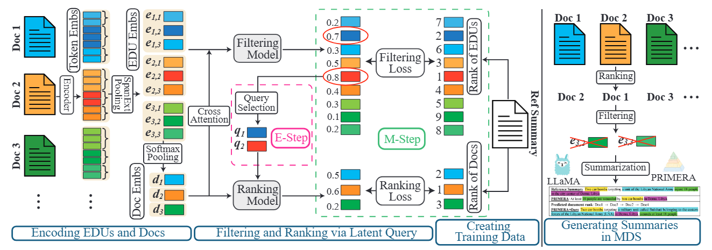
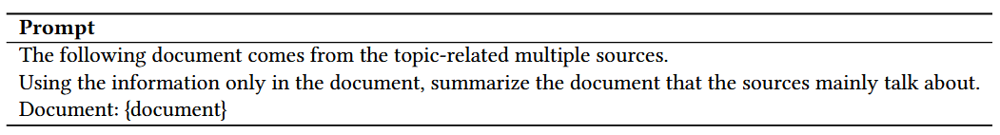

<h1 align="center"> <p>ReREF</p></h1>
<h3 align="center">
    <p>"A Unified Retrieval Framework with Document Ranking and EDU Filtering for Multi-document Summarization" </p>
</h3>

## Introduction
This is the code for ReREF, a novel retrieval-based framework that integrates query selection and document ranking and shortening into a unified process. Our approach identifies the most salient elementary discourse units (EDUs) from input documents and utilizes them as latent queries. These queries guide the document ranking by calculating relevance scores through a multi-query mechanism. Instead of depending on traditional truncation, our approach filters out irrelevant EDUs to fit within the context length, ensuring that only the most critical information is preserved for summarization. 
We evaluate our framework on multiple MDS datasets, demonstrating consistent improvements in ROUGE metrics while confirming its scalability and flexibility across diverse model architectures. 

## Framework

<!--  -->


## Set up
1. Create a python environment with python 3.9 and the packages in requirements

install with pip (we recommend use conda):
```
pip install -r requirements.txt
```

## Usage of ReREF
Usage of ReREF follows the procudure of our framework, which include three steps: 1. Datasets creating, 2. Retriever training, 3. summarizer training


### 1. Datasets creating
1. Download the source code of DMRST_Parser from [here](https://github.com/seq-to-mind/DMRST_Parser) to `./DMRST_Parser`.
2. Install python package `sentence_transformers`, and download the Semantic Search model `multi-qa-mpnet-base-cos-v1`
3. Use the jupyter notebook `make dataset upload.ipynb` to create dataset for retriever training. 

### 2. Retriever training
After creating the dataset for retriver training, which uses ` ||||| ` to split documents and uses ` || ` to split EDUs, you can use `retriever/run_train_test.sh` for train/test retriever. 
Or you can use following script to train the retriever
```shell
python rank_primer.py --mode ${mode} --loss_type bpr
            --model_path ${model_path} --strategy auto --dataset_name ${dataset_name}
```
After the retriever training, you should update the dataset with the prediction of document ranks and edu scores by the retriever, same as `make dataset upload.ipynb`. 

### 3. Summarizer training
You can use `summarizer/primer_main_modify.py` for train/test PRIMERA on the truncation strategy with retriever results or the original truncation strategy, and `summarizer/compared_model_main_modify.py` for train/test BART/PEGASUS/LED.
You can follow the shell script `summarizer/run_train_shell.sh` to fully/few-shot supervised train summarizer models. 
```shell
python primer_hf_main_modify.py --mode ${mode} 
        --model_path ${model_path} --beam_size 5 --batch_size 16 --strategy auto 
        --model_name ${model_name} --join_method truncate_last_ranking_filtering 
        --dataset_name ${dataset_name}
```

For Large Language Models, Llama 3 and StableLM-Zephyr, we use [LitGPT](https://github.com/Lightning-AI/litgpt) to achieve fast and convenient training. The prompt used for LLMs is

| **Prompt** |
|--------|
| ```The following document comes from the topic-related multiple sources. Using the information only in the document, summarize the document that the sources mainly talk about. ```|
| ```Document: ${document}```  |

<!--  -->


## Datasets
All these original datasets are provided PRIMERA. 
- For Multi-News and Multi-XScience, it will automatically download from Huggingface.
- WCEP-10: the preprocessed version can be found [here](https://storage.googleapis.com/primer_summ/wcep-10.tar.gz)
- Wikisum: we only the subset version provided by PRIMERA, which can be found [here](https://storage.googleapis.com/primer_summ/wikisum_subset.tar.gz).

